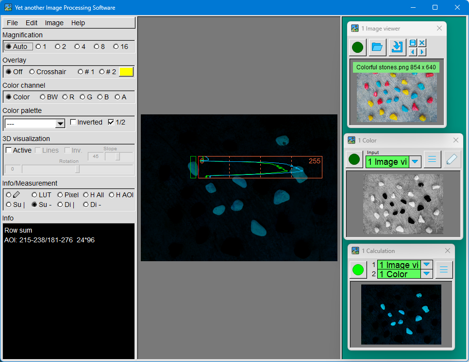

# YaIPS

#### Yet another Image Processing Software

---

##### About YaIPS

YaIPS is an abbreviation for "Yet another Image Processing Software".

Literally translated, this means "Yet another image processing software" and humorously alludes to the fact that there are many such programs.

Unlike **image editing** (which visually alters an image, e.g. retouching, color correction), **image processing** involves analyzing or automatically evaluating an image (e.g. measurement, object recognition). While the two terms sound similar, they pursue entirely different goals.

Industrial **image processing** uses cameras and software to **automatically** detect features, defects, or properties of products – usually directly on a production line. The goal is **to monitor** and **control manufacturing processes** or to **inspect finished products**.

For further information on **industrial image processing**, **lighting**, **optics**, or **cameras**, it's worth taking a look at the [Vision Doctor](https://www.vision-doctor.com/) website. These topics are explained clearly there in both German and English.

**YaIPS** is a program that allows you **to playfully explore the algorithms and methods used in image processing**.

Particular emphasis was placed on

* to make the results of each processing visible,
* to keep the operation simple and intuitive.

YaIPS is therefore ideally suited for **trying out** and **understanding image processing**.

---

##### User Interface Overview

The main window is the central element of the user interface. It is divided into three areas:

* Left area: This contains the menu bar as well as numerous functions to display, change or analyze the image in the middle area.
* Middle area: The current image is displayed in this area.
* Right area: This area is used to place the **tool windows**.

**Tool windows** are the core of YaIPS. They process images and pass them on to other tool windows for further processing. In this way, the tool windows can be linked together to perform more complex image processing tasks.

---

##### Features

* Image analysis
  Color channel display, false color representation, 3D representation, measurement of color values, color histograms, horizontal or vertical brightness profiles, measuring distances.
* Import/generate images
  from camera, file, video player, or generate images in defined sizes.
* Image processing
  filtering images, modifying color, geometric corrections, image processing, correlation, object extraction, …
* Output images.
  Save images as .jpg, .png or .tga. Create videos.
* Inspect images 
  Take a reference image, measure or correct color, correct position, measure distances, compare image parts.
* Other
  Overlay images, shapes or text (can also be used to create posters or shareable images).

---

##### Installation

Windows is the only supported operating system.

The release download is a .zip file. Extract this file to a suitable location. Double-click YaIPS.exe to launch the application.
